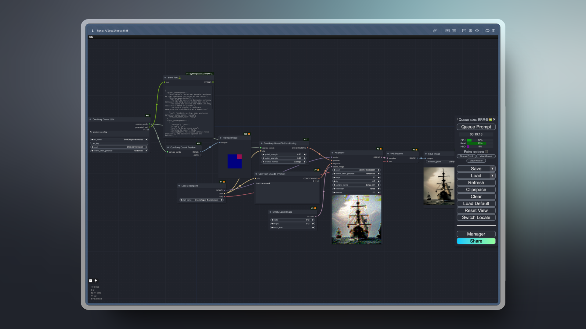

# Comflowy ComfyUI Extension

<div>

  
  <a href="https://discord.gg/cj623WvcVx">
    
  </a>

  [中文说明](./README_CN.md)
</div>

When using ComfyUI, most of the models we use are open-source models. Some closed-source models with excellent results cannot be used in ComfyUI. To solve this problem, we developed the Comflowy extension. We hope to integrate these high-quality closed-source models into ComfyUI, so that users can chain together various closed-source models through ComfyUI.


## I. Node List

1. **Comflowy LLM Node:** This is a node that calls LLM. You can use it to implement functions similar to Prompt Generator. Unlike other LLM nodes on the market, it obtains results by calling APIs, which means you don't need to install Ollama to call LLM models. No need to worry about whether your computer configuration is sufficient to run these LLM models. **It's also free**.
   * You can use our online version of Comflowy to run [workflows](https://app.comflowy.com/template/84bea01c-e109-41f2-89c6-914fc999a1cf) containing this node.
   * You can also download the [workflow file](workflows/LLM_CN.json) and import it into ComfyUI for use.
   * <details>
      <summary>Workflow Screenshot</summary>
      <br/>

      
    </details>
2. **Comflowy Omost Node:** The [Omost](https://github.com/lllyasviel/Omost) extension is a extension that helps you write prompts, but running this extension locally requires a computer with higher configuration. Based on our understanding of Omost, we implemented a similar node, but slightly different in that we didn't run Omost's official model, but implemented it through Prompt Engineering. This way, the running speed will be faster.
   * Online version [workflow](https://app.comflowy.com/template/1ce47688-4c85-42af-88ad-290f283eb9ec).
   * Local version [workflow file](workflows/Omost_LLM.json).
   * <details>
      <summary>Workflow Screenshot</summary>
      <br/>
      
      
    </details>
3. **Comflowy Flux Pro Node:** Flux is a node that can generate images with Flux Pro. Flux Pro is a non open source model, so in most cases, you cannot use this model in ComfyUI. To solve this problem, we developed this node, which allows you to generate images directly in ComfyUI. But please note that this model is a commercial model, so each use will deduct your credits.
   * Online version [App](https://app.comflowy.com/app/app-general-image-by-flux-153b).
   * <details>
      <summary>Workflow Screenshot</summary>
      <br/>

      
    </details>
4. **Comflowy Flux Pro Ultra Node:** Flux Pro Ultra is the latest high-definition model released by Flux. You can also set the Raw parameter to True, so that the output images will be more realistic and detailed.
5. **Comflowy Flux Dev Lora Node:** Flux Dev Lora node is a node that allows you to load any Flux LoRA. You only need to fill in the download address of the Flux LoRA model into the node to load and use it.
6. **Comflowy Ideogram Node:** Ideogram is a node that can generate images with Ideogram. Similar to Flux, Ideogram is a non open source model, so in most cases, you cannot use this model in ComfyUI. To solve this problem, we developed this node, which allows you to generate images directly in ComfyUI. But please note that this model is a commercial model, so each use will deduct your credits.
   * Online version [App](https://app.comflowy.com/app/app-general-image-by-ideogram-b453).
   * <details>
      <summary>Workflow Screenshot</summary>
      <br/>

      
    </details>
7. **Comflowy Recraft Node:** Similar to Flux, Recraft is a non open source model, so in most cases, you cannot use this model in ComfyUI. To solve this problem, we developed this node, which allows you to generate images directly in ComfyUI. But please note that this model is a commercial model, so each use will deduct your credits. This model is similar to Ideogram, and is very suitable for generating images with text.
8. **Comflowy Clarity Upscale Node:** This is a node that can upscale images. This node is claimed to be a replacement for Magnific. The overseas influencer developer [levlsio](https://twitter.com/levelsio/status/1827404021684170902) praised this model.
   * Online version [App](https://app.comflowy.com/app/app-clarity-upscale-4257).
   * <details>
      <summary>Workflow Screenshot</summary>
      <br/>

      
    </details>
9. **Comflowy Replicate Node:** Thanks to [Replicate](https://github.com/replicate/comfyui-replicate) for providing services and code, now you can use the models in Replicate.
10. **Comflowy Hailuo Video Node:** This node uses the Hailuo AI model, which can convert images to videos. Note that this node requires the Comflowy Preview Video node to be used.
11. **Comflowy Kling Image Node:** This node uses the Kling AI model, which can convert images to videos. Note that this node requires the Comflowy Preview Video node to be used.


## II. Price

| Node | Price |
| --- | --- |
| LLM | Free |
| Omost | Free |
| Flux Pro | Flux-1.1-pro costs approximately 400 credit per image. Flux-pro costs 550 credits per image. |
| Flux Pro Ultra | 600 credits per image. |
| Flux Dev Lora | 350 credits per image. |
| Ideogram | Ideogram-v2-turbo costs approximately 800 credit per image. Ideogram-v2 costs 500 credits per image. |
| Recraft | This model costs approximately 400～800 credits per image, depending on your inputs. |
| Replicate | This depends on the model you use and the time consumed. |
| Hailuo | This costs approximately 5000 credits per video. |
| Kling | This costs credits based on the length of the video. |

## III. How to Use

> [!NOTE]
> It should be noted that when using the Comflowy extension, there may be situations where it cannot be used normally due to network problems. If you encounter an error like `Failed to get response from LLM model with https://app.comflowy.com/api/open/v0/prompt`, you need to check your network status.

<details>
  <summary>Step 1: Install Comflowy ComfyUI Extension</summary>

- Method 1: Install using [ComfyUI Manager](https://github.com/ltdrdata/ComfyUI-Manager) (recommended)
- Method 2: Git installation
    
    Open a cmd window in the CompyUI extension directory (e.g., "CompyUI\custom_nodes\") and type the following command:

    ```shell
    git clone https://github.com/6174/comflowy-nodes.git
    ```

- Method 3: Download zip file
    
    Or download and unzip the zip file, copy the resulting folder to the ```ComfyUI\custom_nodes\``` directory.

</details>

<details>
  <summary>Step 2: Obtain Comflowy API Key</summary>
  
  Next, you need to obtain the Comflowy API Key. Click on the avatar in the bottom left corner (Figure ①), then click on Settings (Figure ②), and finally find the API Key (Figure ③) and copy it. **Note: For security reasons in future use, please do not disclose your API Key to others.**
  
  
</details>

<details>
  <summary>Step 3: Enter Comflowy API Key</summary>

  Lastly, you need to input the API Key into the Comflowy Set API Key node. After entering it, you can delete this node. Then you can use other Comflowy nodes. If you don't input this node, you won't be able to use Comflowy nodes.
  
  
</details>

## IV. Update Log

* V0.2: Added Flux node, Ideogram node.
* V0.1: Support for LLM node, Omost node, Http node.

## V. Acknowledgements

1. Thanks to [SiliconFlow](https://siliconflow.cn/) for providing free LLM services.
2. Thanks to the author of [Omost](https://github.com/lllyasviel/Omost) and the author of the [ComfyUI-Omost](https://github.com/huchenlei/ComfyUI_omost?tab=readme-ov-file) extension.
3. Thanks to all who contributed to this open source project:

<a href="https://github.com/6174/comflowy-nodes/graphs/contributors">
  
</a>