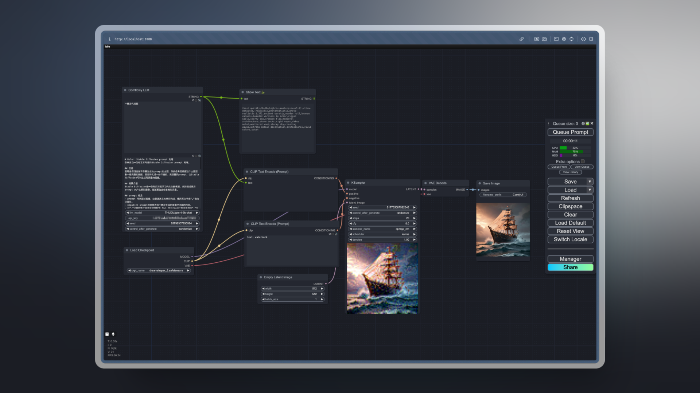

# Comflowy ComfyUI Extension

<div>

  
  <a href="https://discord.gg/cj623WvcVx">
    
  </a>

  [中文说明](./README_CN.md)
</div>

While developing Comflowy, we found that although there are many extensions in the community, many nodes are more focused on solving specific problems or implementing certain technologies. In terms of user experience, they are relatively less friendly.

So we decided to develop some general-purpose nodes based on our needs to help you better use ComfyUI.

## I. Node List

1. **Comflowy LLM Node:** This is a node that calls LLM. You can use it to implement functions similar to Prompt Generator. Unlike other LLM nodes on the market, it obtains results by calling APIs, which means you don't need to install Ollama to call LLM models. No need to worry about whether your computer configuration is sufficient to run these LLM models. **It's also free**.
   * You can use our online version of Comflowy to run [workflows](https://app.comflowy.com/template/84bea01c-e109-41f2-89c6-914fc999a1cf) containing this node.
   * You can also download the [workflow file](workflows/LLM_CN.json) and import it into ComfyUI for use.
   * <details>
      <summary>Workflow Screenshot</summary>
      <br/>

      
    </details>
2. **Comflowy Omost Node:** The [Omost](https://github.com/lllyasviel/Omost) extension is a extension that helps you write prompts, but running this extension locally requires a computer with higher configuration. Based on our understanding of Omost, we implemented a similar node, but slightly different in that we didn't run Omost's official model, but implemented it through Prompt Engineering. This way, the running speed will be faster.
   * Online version [workflow](https://app.comflowy.com/template/1ce47688-4c85-42af-88ad-290f283eb9ec).
   * Local version [workflow file](workflows/Omost_LLM.json).
   * <details>
      <summary>Workflow Screenshot</summary>
      <br/>
      
      
    </details>

## II. How to Use

> [!NOTE]
> It should be noted that when using the Comflowy extension, there may be situations where it cannot be used normally due to network problems. If you encounter an error like `Failed to get response from LLM model with https://app.comflowy.com/api/open/v0/prompt`, you need to check your network status.

<details>
  <summary>Step 1: Install Comflowy ComfyUI Extension</summary>

- Method 1: Install using [ComfyUI Manager](https://github.com/ltdrdata/ComfyUI-Manager) (recommended)
- Method 2: Git installation
    
    Open a cmd window in the CompyUI extension directory (e.g., "CompyUI\custom_nodes\") and type the following command:

    ```shell
    git clone https://github.com/6174/comflowy-nodes.git
    ```

- Method 3: Download zip file
    
    Or download and unzip the zip file, copy the resulting folder to the ```ComfyUI\custom_nodes\``` directory.

</details>

<details>
  <summary>Step 2: Get Comflowy API Key</summary>
  
  Next, you need to get the Comflowy API Key. Click on the avatar in the lower left corner (Figure 1), then click on Settings (Figure 2), and finally find the API Key (Figure 3) and copy it.
  
  
</details>

<details>
  <summary>Step 3: Configure Comflowy extension</summary>

  Finally, you need to input the API Key into the node. For example, there's an API Key input box in the LLM node where you need to paste the API Key you just copied:
  
  
</details>

## III. Update Log

* V0.1: Support for LLM node, Omost node, Http node.

## IV. Acknowledgements

1. Thanks to [SiliconFlow](https://siliconflow.cn/) for providing free LLM services.
2. Thanks to the author of [Omost](https://github.com/lllyasviel/Omost) and the author of the [ComfyUI-Omost](https://github.com/huchenlei/ComfyUI_omost?tab=readme-ov-file) extension.
3. Thanks to all who contributed to this open source project:

<a href="https://github.com/6174/comflowy-nodes/graphs/contributors">
  
</a>