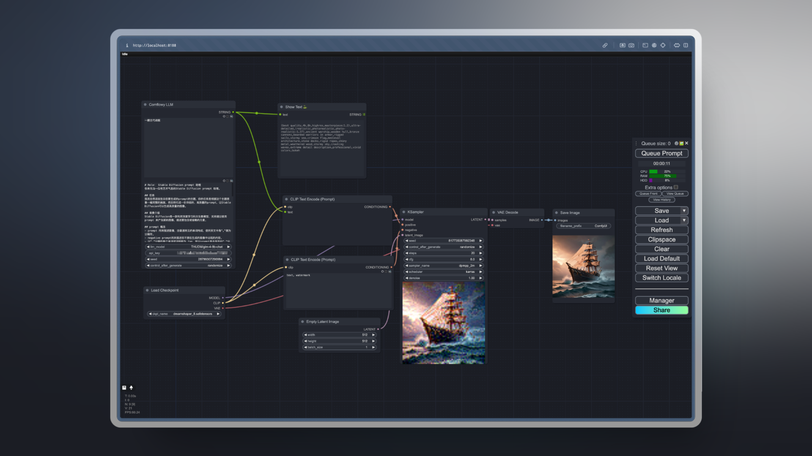
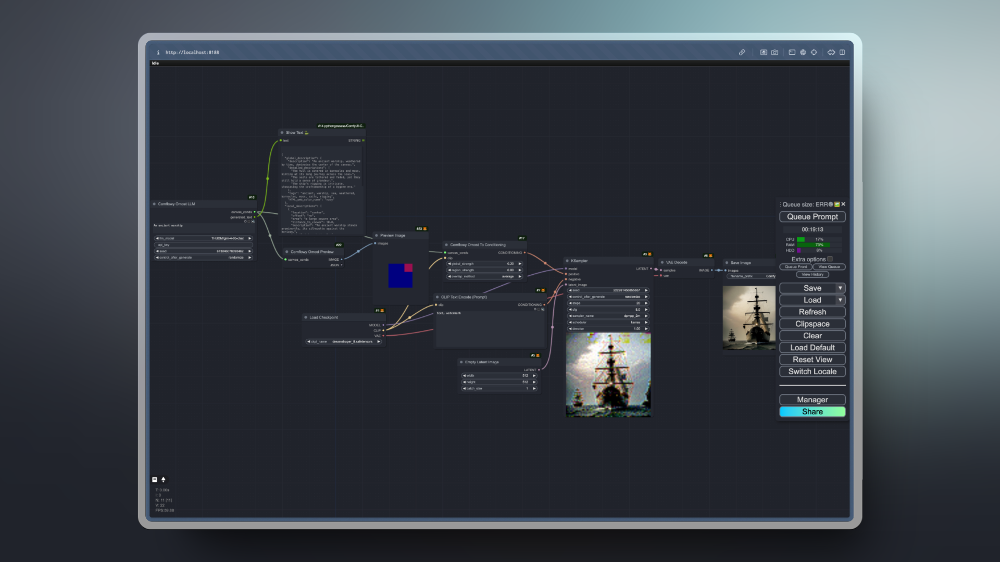
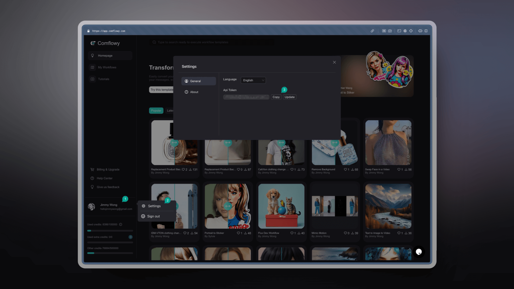
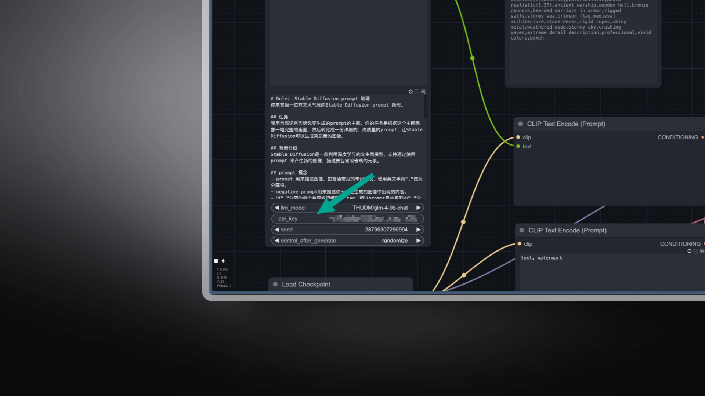

# Comflowy 插件

<div>

  
  <a href="https://discord.gg/cj623WvcVx">
    
  </a>

</div>

在开发 Comflowy 产品的时候，我们发现虽然社区里有很多插件，但有不少节点更多的是为了解决特定的问题，或者实现某个特定的技术。在用户体验上，相对没那么友好。

所以我们决定根据我们的需求，开发一些通用的节点，以便各位更好地使用 ComfyUI。

## 一、节点列表

1. **Comflowy LLM 节点：** 这是一个调用 LLM 的节点。你可以用它来实现类似 Prompt Generator 的功能。它与市面上的 LLM 节点不同的是，它是通过调用 API 的方式获取结果，这就意味着你不需要安装 Ollama 就能调用 LLM 模型。不再需要担心你的电脑配置是否足够运行这些 LLM 模型。**同时它还是免费的**。
   * 你可以使用我们的在线版 Comflowy 运行包含此节点的 [工作流](https://app.comflowy.com/template/84bea01c-e109-41f2-89c6-914fc999a1cf)  。
   * 也可以下载 [工作流文件](workflows/LLM_CN.json) 并导入到 ComfyUI 里使用。
   * <details>
      <summary>工作流截图</summary>
      <br/>

      
    </detials>
2. **Comflowy Omost 节点：** [Omost](https://github.com/lllyasviel/Omost) 插件是一个能帮助你撰写 Prompt 的插件，但本地运行此插件，需要配置较高的电脑。我们基于对 Omost 的理解，实现了一款类似的节点，但与之稍微不同的是，我们并没有运行 Omost 官方的模型，而是通过 Prompt Engineering 的方式实现。这样运行的速度会更快一些。
   * 在线版 [工作流](https://app.comflowy.com/template/1ce47688-4c85-42af-88ad-290f283eb9ec)。
   * 本地版 [工作流文件](workflows/Omost_LLM.json) 。
   * <details>
      <summary>工作流截图</summary>
      <br/>
      
      
    </detials>

## 二、如何使用

> [!NOTE]
> 需要注意，在使用 Comflowy 插件的时候，有可能会出现因为网络问题导致无法正常使用的情况。如果遇到类似 `Failed to get response from LLM model with https://app.comflowy.com/api/open/v0/prompt` 的报错，请检查一下网络状态。

<details>
  <summary>Step 1: 安装 Comflowy 插件</summary>

- 方法一：使用 [ComfyUI Manager](https://github.com/ltdrdata/ComfyUI-Manager)  安装（推荐）
- 方法二：Git 安装
    
    CompyUI插件目录(例如“CompyUI\custom_nodes\”)中打开cmd窗口，键入以下命令：

    ```shell
    git clone git clone https://github.com/6174/comflowy-nodes.git
    ```

    然后启动 ComfyUI。

- 方法三：下载zip文件
    
    或者下载解压zip文件，将得到的文件夹复制到 ```ComfyUI\custom_nodes\``` 目录下，然后启动 ComfyUI。

</details>

<details>
  <summary>Step 2: 获取 Comflowy API Key</summary>
  
  接着你需要获取 Comflowy 的 API Key，点击左下角的头像（图①），再点击设置（图②）， 最后找到 API Key（图③） 并复制它。**注意，为了后续使用的安全性，请不要将你的 API Key 泄露给他人。**
  
  
</details>

<details>
  <summary>Step 3: 输入 Comflowy API Key</summary>

  最后需要将 API Key 输入到 Comflowy Set API Key 节点里。输入完后，你可以删除此节点。然后使用 Comflowy 的其他节点。如果你没有输入这个节点，那么你将无法使用 Comflowy 的节点。
  
  
</details>

## 三、更新记录

* V0.1：支持 LLM 节点、Omost 节点、Http 节点。

## 四、感谢

1. 感谢 [SiliconFlow](https://siliconflow.cn/) 提供的免费 LLM 服务。
2. 感谢 [Omost](https://github.com/lllyasviel/Omost) 作者以及 [ComfyUI-Omost](https://github.com/huchenlei/ComfyUI_omost?tab=readme-ov-file) 插件的作者。
3. 感谢所有为此开源项目做出贡献的人：

<a href="https://github.com/6174/comflowy-nodes/graphs/contributors">
  
</a>
