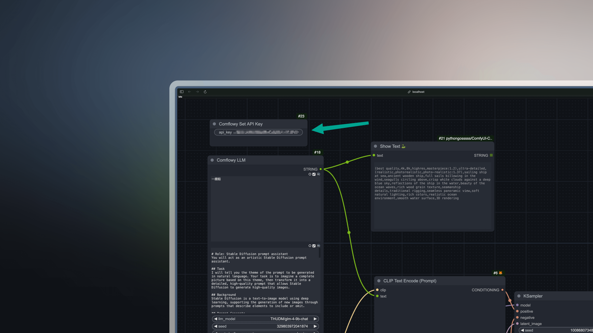

# Comflowy 节点

在开发 Comflowy 产品的时候，我们发现虽然社区里有很多插件，但有不少节点更多的是为了解决特定的问题，或者实现某个特定的技术。在用户体验上，相对没那么友好。

所以我们决定根据我们的需求，开发一些通用的节点，以便各位更好地使用 ComfyUI。

## 节点列表

## 如何使用

### Step 1: 安装 Comflowy 插件

* 方法一：使用 [ComfyUI Manager](https://github.com/ltdrdata/ComfyUI-Manager)  安装（推荐）

* 方法二：Git 安装

CompyUI插件目录(例如“CompyUI\custom_nodes\”)中打开cmd窗口，键入以下命令：

```shell
git clone https://github.com/chflame163/ComfyUI_LayerStyle.git
```

* 方法三：下载zip文件
或者下载解压zip文件，将得到的文件夹复制到 ```ComfyUI\custom_nodes\``` 目录下。


### Step 2: 获取 Comflowy API Key

接着你需要获取 Comflowy 的 API Key，点击左下角的头像（图①），再点击设置（图②）， 最后找到 API Key（图③） 并复制它。


### Step 3: 配置 Comflowy 插件

最后需要将 API Key 输入到节点里，比如 LLM 节点里就有一个 API Key 的输入框，你需要将刚才复制的 API Key 粘贴到这里：


> [!NOTE]
> 需要注意，使用 Comflowy 插件有可能会出现因为网络问题，而导致无法正常使用的情况。如果遇到类似 `Failed to get response from LLM model with https://app.comflowy.com/api/open/v0/prompt` 的问题，需要你检查一下网络状态。

## 更新记录

## 感谢
1. 感谢 [SiliconFlow](https://siliconflow.cn/) 提供的免费 LLM 服务。
2. 感谢所有为此开源项目做出贡献的人：

<a href="https://github.com/6174/comflowy-nodes/graphs/contributors">
  
</a>